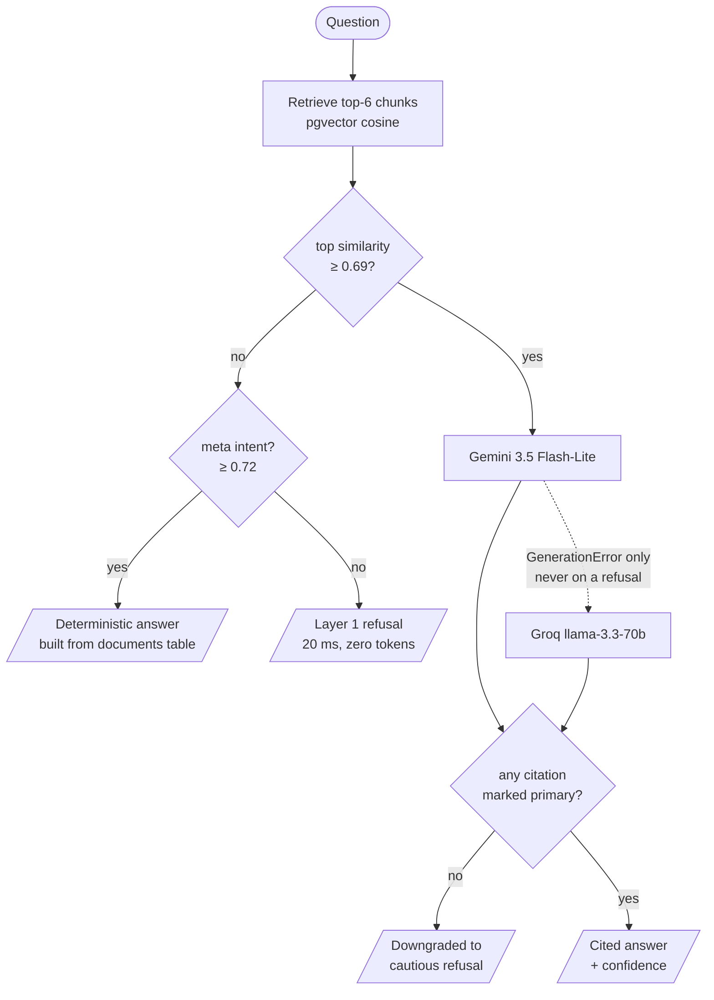

<div align="center">

# Compliance Copilot

**A retrieval-augmented assistant for Indian securities-market circulars (SEBI · NSE · MCX)
on retail participation in algorithmic trading — every answer cited to a specific document
and section, or declined.**

[](https://compliance-copilot-eight-sigma.vercel.app)
[](https://compliance-copilot-backend.onrender.com/health)
[](https://github.com/pgvector/pgvector)
[](https://fastapi.tiangolo.com)
[](https://nextjs.org)

</div>

> [!NOTE]
> The backend runs on Render's free tier, which spins down after ~15 minutes idle. The
> first request after that can take 50s+ or briefly return a 503 while it wakes up.
> That's the host, not the app — see [Production changes](#production-changes).

> [!IMPORTANT]
> **Document disclosure.** The corpus is 9 real SEBI/NSE/MCX circulars on retail
> algorithmic trading, a domain I already work with — not a pack provided by SARC. The
> brief allows using your own small document set in place of the provided pack, on the
> condition that you say so. This is that disclosure.

---

## Quick start

```bash
cp backend/.env.example backend/.env              # add GROQ_API_KEY and GEMINI_API_KEY
cp frontend/.env.local.example frontend/.env.local
docker compose up
```

Both keys are required: generation is Gemini-primary with Groq as fallback, so the
fallback needs its own key.

| Service | Port | Notes |
|---|---|---|
| Postgres (pgvector) | `5432` | schema applied on first boot |
| FastAPI backend | `8000` | `POST /ingest` loads the corpus |
| Next.js frontend | `3000` | |

```bash
curl -X POST localhost:8000/ingest                       # 9 documents → 58 chunks
docker compose exec backend python -m eval.run_eval      # eval harness
```

Re-verified from a genuinely fresh `git clone` (not a copy) immediately before writing
this: `docker compose up` → `/ingest` → eval all run clean with no changes needed.

---

## How it works



The two-layer refusal gate is the core design. **Layer 1** is a similarity threshold that
skips the model entirely for out-of-scope questions. **Layer 2** is the model's own
judgment, and it is load-bearing rather than a backstop — no threshold can catch a
question that is *in-domain but unanswerable*.

---

## Results

Eval harness, run from a fresh clone against the current 9-document corpus. Full output
in [`backend/eval/`](backend/eval/).

| Metric | Score | |
|---|---|---|
| Retrieval hit rate | **6/6** | expected document in top-6 |
| Answer contains expected string | **6/6** | |
| Citation accuracy | **5/6** | see [corpus growth](#corpus-growth) for the one miss |
| Refusal accuracy | **8/10** | 10-question set, 4 deliberately unanswerable |

| Path | Latency | Cost |
|---|---|---|
| Layer 1 threshold refusal | **~20 ms** | zero tokens |
| Generated answer (Gemini) | **~2.0 s** | |
| Generated answer (Groq, fallback) | **~10.9 s** | |
| Worst case with Gemini hanging | **16.4 s** | measured, DNS-blackholed |

Layer-1 refusals run **~95× faster** than a generated answer at zero token cost.

---

## The corpus

Nine real circulars, fetched and text-extracted from source rather than written from
memory. The panel in the app links to each one, served from `GET /documents` — driven by
the database, never a hardcoded list.

| Date | Issuer | What it covers |
|---|---|---|
| 30 Mar 2012 | SEBI | The original algo rulebook — defines an algo order and the risk controls exchanges and brokers must run |
| 04 Feb 2025 | SEBI | The framework everything else implements — API access, algo registration, responsibilities |
| 01 Apr 2025 | SEBI | First deadline extension for implementation standards |
| 05 May 2025 | NSE | Client-facing standards — static IP, the 10 orders/second threshold, two-factor auth |
| 22 Jul 2025 | NSE | Algo provider empanelment and registration, including turnaround times |
| 24 Jul 2025 | NSE | Corrigendum revising the order-tagging (NNF ID) tables |
| 30 Sep 2025 | SEBI | The glide path — three milestones to Jan 2026, full compliance by Apr 2026 |
| 03 Nov 2025 | NSE | Member FAQ — static IP scope, black box hosting, permitted order types |
| 21 Nov 2025 | MCX | Reminder of milestone dates and consequences for missing them |

---

## TL;DR

The full write-up below is long — this is the one-page version, for the scoring criteria
roughly in the order the brief lists them.

- **Works end to end from a clean checkout.** Verified with an actual `git clone` into a
  scratch directory, not assumed from the working copy. Also deployed and live, which is
  not required but removes any doubt.
- **Eval, from that same fresh clone**: 6/6 retrieval, 5/6 citation accuracy, 8/10 refusal
  accuracy. Layer-1 refusals ~95× faster than a generated answer at zero token cost —
  down from an earlier ~565× measured before Gemini replaced Groq as primary generator.
- **Growing the corpus from 5 to 9 documents cost something real, measured rather than
  glossed over.** One previously-clean question now retrieves a competing procedural chunk
  ahead of the definition it needs, and the citation-consistency check correctly downgrades
  it to a cautious refusal. The safety net did its job; retrieval got measurably noisier,
  and that's reported here rather than left for someone else to find.
- **Refuses rather than fabricates**, and the eval measures this rather than asserting it —
  reporting honestly even when a question is answered-but-hedged rather than formally refused.
- **Two known limitations, both measured, not hand-waved.**
- **One optional extra, done properly**: deployment. Not auth, not function calling, not a
  review flow — the brief asks to pick one rather than spread thin.

---

## Write-up

### What was built

The full pipeline, end to end: **ingestion** (YAML frontmatter parsed straight into the
`documents` table), **section-aware chunking**, **pgvector cosine retrieval**, a
**two-layer refusal gate**, **structured generation** (Gemini primary, Groq fallback) via
instructor + Pydantic, an **eval harness**, and a **Next.js frontend** rendering answers
with citation chips and a confidence badge, alongside a panel listing the indexed corpus —
served from `GET /documents`, driven by the database rather than a hardcoded list, after a
hardcoded header count silently kept claiming "5 circulars indexed" once the corpus had
grown to 9.

### What was left out

No authentication. No multi-turn chat — each query is independent, and session history is
in-memory React state only (the `queries` table already persists everything server-side; a
UI for browsing past sessions wasn't part of the brief). No chunk-text-preview on
citations, which would have required an extra endpoint for no grading benefit — citations
already carry issuer, doc_id and section, which is what "show which document and section
each answer came from" asks for.

**Of the optional extras, one was done properly and the rest skipped**, per the brief's own
steer: function calling, a review/approve-reject flow, and prompt/token-cost logging were
all left out. Deployment was the one done — Neon (Postgres+pgvector), Render (backend),
Vercel (frontend).

<details>
<summary><b>Four real production bugs that deployment surfaced</b> — the kind that only show up outside a dev machine</summary>

<br/>

1. **The Dockerfile hardcoded port 8000** and ignored the `$PORT` Render injects, which
   would have made the service unreachable despite running.
2. **A plain `pip install` pulled PyTorch's full CUDA/GPU build** on a CPU-only workload,
   producing an 8.68GB image against a free-tier disk budget nowhere near that.
3. **`/ingest`'s batch embedding call exceeded the free tier's memory limit** and got
   OOM-killed mid-request — confirmed via Render's own crash notification, not guessed at.
4. **A routine corpus-expansion deploy OOM-killed at pure startup**, before the port even
   bound — root-caused to `import torch` alone costing ~394MB resident. No amount of
   dependency pinning fixed it, because it wasn't version drift; it was PyTorch's own
   baseline footprint. See [Embeddings](#embeddings) for the fix.

All four fixed and re-verified against the live deploy, not just locally.

</details>

---

### Tradeoffs

#### Chunking

Split on markdown headers, then on numbered clauses within a section — chosen because
every source circular is *already* numbered, so precise section citation came essentially
for free with no need to infer structure.

<details>
<summary>The one real judgment call, and why getting it wrong would have been worse than useless</summary>

<br/>

Bare top-level clauses that happen to follow the `V. Categorization of Algos` header do
**not** inherit `"V"` as their `section_number`, because they aren't children of it —
they're the document's own clauses 6–10 continuing past that heading. A section's letter
only compounds onto its clauses when numbering restarts at 1 within it (as in the NSE
annexure's sections A–J).

Getting this wrong would have produced confidently mis-attributed citations, which is
worse than none.

</details>

#### Corpus growth

The corpus grew from 5 to 9 documents after initial submission — four more real, verified
SEBI/NSE circulars, two of which close a genuine gap: SEBI's original 2012 circular was
already referenced by name in doc 01 as historical background but wasn't in the corpus, and
NSE's `INVG/69255` was referenced by three other documents without being present either.

**That expansion had a real, measured cost, not just a benefit.**

<details>
<summary>Citation accuracy dropped 6/6 → 5/6 — the full diagnosis</summary>

<br/>

The question *"what's the difference between a white box and black box algo"* used to
retrieve doc 01's clean definitional chunk as its top hit. With four more documents, a
procedural chunk from the new `NSE/INVG/69255` — which mentions "Whitebox or Blackbox" in
the context of the *registration workflow*, not the definition — now outranks it.

The model still answers correctly in prose, but stops attaching a confident `primary`
citation, and the consistency check correctly catches that and downgrades it to a cautious
refusal rather than presenting an under-cited answer as confident. Confirmed reproducible,
not a one-off: **5/5 reruns showed the same result**.

The safety net is working exactly as designed; the underlying retrieval simply got noisier
as more topically-overlapping content was added — a direct, measured illustration of why
"add more documents" is not a free way to make a RAG system look more capable. The
similarity threshold itself needed no retuning: 0.69 still separates every genuinely
off-topic distractor from every genuinely answerable question in the eval set.

</details>

#### Models

Generation is Gemini-primary with a Groq fallback (`llama-3.3-70b-versatile`); Groq was the
original single-provider choice. Embeddings are local (`bge-small-en-v1.5`, 384 dims)
because **Groq has no embeddings endpoint** — that constraint, not preference, drove local
embedding, and it still holds regardless of which provider generates the answer.

#### Embeddings

Originally ran through `sentence-transformers`, which depends on PyTorch. A routine
corpus-expansion deploy OOM-killed at pure container startup on Render's free tier — before
a single request, before the port even bound.

<details>
<summary>Why dependency pinning didn't fix it, and what did — ONNX Runtime, measured</summary>

<br/>

Pinning dependency versions (a real, separate fix, kept) didn't resolve it, which was the
first sign this wasn't version drift. Measured precisely rather than guessed at:

| | Peak memory |
|---|---|
| `import torch` alone, before any model | **~394 MB** |
| Total, smallest available embedding model | **528–544 MB** |
| Render free-tier ceiling | **512 MB** |
| After the fix (ONNX Runtime) | **~234 MB** |

Swapping the wrapper library saved only ~16MB — the cost is PyTorch's own baseline, not the
library on top of it.

**The fix:** ONNX Runtime instead of PyTorch, running the same `bge-small-en-v1.5` weights
via a widely-used community ONNX export (`Xenova/bge-small-en-v1.5`), with manual CLS-token
pooling and L2 normalization replicating `sentence-transformers`' own reported pipeline for
this model (`pooling_mode: cls`, verified from its actual module config rather than assumed
from BGE's general documentation).

**Verified before trusting it**, across seven realistic corpus and query strings: cosine
similarity 1.0, max absolute difference ~1e-7 (pure floating-point noise) — nowhere close
to disturbing a similarity threshold whose narrowest observed band was 0.004. The full eval
suite was re-run after the swap and produced numbers identical to four decimal places,
confirming zero behavioral drift rather than assuming it from the cosine check alone.

The ONNX weights are fetched once — baked into the image at Docker build time in production,
self-downloaded on first run in local dev, where a bind mount hides the image's baked-in
copy — rather than re-fetched from the HF Hub on every boot.

</details>

#### Structured output

instructor + Pydantic enforce the `ComplianceAnswer` schema.

<details>
<summary>A Groq-specific bug worth naming: <code>Mode.TOOLS</code> silently discarded correct answers</summary>

<br/>

llama-3.3 intermittently emits a stringly-typed boolean (`"refused": "false"`), and Groq
validates tool-call arguments *server-side*, rejecting the whole request with a 400 before
instructor's retry logic ever runs. The answer was correct; it was thrown away in transport.

Switching to `Mode.JSON` moves validation client-side, where Pydantic coerces
`"false" → False` and retries actually engage.

</details>

#### Questions about the assistant itself

*"What can you do?"* and *"What circulars do you have?"* are not questions about document
*contents*, so retrieval scores them 0.50 and 0.64 — below the 0.69 gate. The refusal was
technically correct and a bad product: a newcomer's first question got a flat decline.

These are answered by a layer (`app/rag/meta.py`) that runs **inside the below-threshold
branch**, so it only ever sees questions retrieval was already going to refuse. It never
calls a model — answers are assembled from live `documents` rows, so the assistant cannot
invent a circular it does not hold or misstate the count, which is the one hallucination
this product least affords.

<details>
<summary>The first version of this shipped broken — and the testing failure is the part worth recording</summary>

<br/>

Intent is matched by embedding similarity against canonical phrasings rather than keyword
rules, because *"what's in your database"* and *"where does your info come from"* share no
keywords but one intent; enumerating phrasings as literals is endless and brittle.

The risk is hijacking a real question, and the first version got it wrong. It ran *before*
retrieval, with a threshold tuned against the gap between meta phrasings and the eval
questions — 20/20 unseen phrasings routed correctly and 0/8 real questions were hijacked,
so it looked verified.

It shipped, and short keyword-style queries immediately broke:

| Query | Retrieval score | What happened |
|---|---|---|
| `MCX circular` | 0.77 | got a document list instead of an answer |
| `22 Jul 2025 circular summary` | 0.75 | got a document list instead of an answer |

Both were questions the documents answered *well*. Short strings embed weakly and drift
toward generic phrasings; a test set made entirely of well-formed questions could never
surface that.

**The fix was ordering, not tuning.** The check now runs inside the below-threshold branch,
so hijacking a real answer is structurally impossible rather than tuned against — the meta
path cannot reach a question the documents can answer. Raising the threshold would have
narrowed the bug without removing it, and would have broken short greetings ("Hi" scores
0.75) on the way.

The lesson is the part worth keeping: **a threshold tuned on one distribution of inputs is
not evidence about a different one**, and "verified" against only well-formed questions was
not verification at all.

</details>

These answers log a `meta/deterministic` provider rather than a model name, so the provider
log keeps reporting how each answer was actually produced.

#### Refusal design — two layers

**Layer 1** is a similarity threshold set to **0.69**, tuned from measured distractor scores
rather than guessed. The initial 0.50 guess turned out to fire *never*.

| | Score |
|---|---|
| Out-of-domain distractors ("capital gains tax rate", "margin for delivery trades") | 0.615 / 0.651 |
| Lowest genuinely answerable question | 0.728 — a hard ceiling |
| **Usable band** | **(0.651, 0.728)** — 0.69 sits in the middle |

**Layer 2** is the model's own refusal, and it is not a backstop — it is load-bearing.
**No threshold can ever catch in-domain-but-unanswerable questions.** *"What are the password
complexity requirements?"* scores 0.739, *above* every answerable question's floor, because
retrieval is working correctly: the documents really do discuss password protection and
expiry. The passage is genuinely related; it just doesn't answer the specific question
asked. Only a reader of the text can tell the difference, so only the model can make that
call.

#### Generation failure vs. refusal

Originally a provider error and a genuine refusal were *shape-identical* — both
`refused=true, confidence="low"`, both HTTP 200. This corrupted two things silently.

<details>
<summary>How a 100%-rate-limited eval run scored a perfect 10/10</summary>

<br/>

Every 429 counted as a correct refusal. And in the UI, a 429 rendered as an amber "not
covered by these documents" card with a raw provider error dump inside it — telling a
compliance user the documents don't address their question when in fact the service was
down. It also fooled me directly: an earlier flakiness estimate I reported was computed
from samples that were actually rate-limit errors.

The fix is a typed `GenerationError` in the generator, which the router converts to **HTTP
503 with a clean body**, while genuine refusals keep their 200 + `refused=true` contract.

The general lesson is why this is worth a section: *a failure mode that is indistinguishable
from a valid outcome is worse than a loud crash.* A crash gets fixed; this silently poisoned
a metric, a UI, and my own reasoning about the system.

</details>

#### Provider failover

Generation tries Gemini (`gemini-3.5-flash-lite`) first, falling back to Groq **only** on a
genuine `GenerationError` — never on a model's own `refused=true`, which is a correct result,
not a failure to route around.

<details>
<summary>Why this was simplified from five tiers to two, and the third same-shaped bug it exposed</summary>

<br/>

**Measured worst case, forcing Gemini to genuinely hang** rather than fail fast (the API host
was DNS-blackholed inside the container, not simulated): **16.4 s** — the 15 s per-model
timeout, then Groq answers normally. The timeout is deliberately tight for exactly this
reason: a failover path that can take longer than the outage it exists to survive isn't a
failover path.

This was originally a five-tier Gemini cascade, measured worst case **31.2 s**, simplified
after a closing review flagged it as disproportionate for a small internal tool. The
two-tier design covers the failure mode actually observed in this build — provider-wide
faults (a bad credential, a missing dependency, an outage) that one model and five models
fail on identically — without adding resilience against a narrower scenario that a
low-traffic tool is unlikely to hit before Groq would have already answered.

**The bug found while building this repeats a pattern seen twice already.** instructor's
Gemini structured output needs the `jsonref` package, which only the
`instructor[google-genai]` extra installs — a bare `google-genai` pin does not pull it in.
Every Gemini call raised `ConfigurationError` silently, the cascade fell through to Groq on
every single request, and Groq produced a fully correct-looking answer under a provider path
that was never actually exercised.

The only reason this was caught rather than shipped is the `provider` field recorded on
every stored query — without it, this would have read as "Gemini works."

> This is the **third bug in this build with the identical shape**: a failure state
> indistinguishable from success until something explicitly logs which path actually ran.
> That repetition, not any one instance, is the real finding — a system's failure modes
> deserve exactly as much verification effort as its success path, because they hide behind
> the same-looking output.

**Once Gemini was actually running, its behavior on the two hardest-won edge cases differed
from Groq's — not just in speed.** On the password-complexity question it never fabricated
across five runs (Groq's pre-fix rate was 40%). On the MCX Milestone 2 question it cited MCX
alone across four runs, with no unexplained cross-issuer co-citation — the exact failure
three separate Groq prompt revisions couldn't resolve. Neither result came from a prompt
change; the shared system prompt is byte-identical across both providers.

That means part of what looked like a hard prompt-design problem was actually
model-specific — worth knowing before assuming the next round of prompt iteration is always
the right lever to pull.

</details>

---

### Known limitations

Both measured, both left in rather than papered over.

#### 1. Citation scoping across issuers

Asked *"what is Milestone 2 according to the MCX circular"*, Groq (the original
single-provider generator) returns the correct MCX provision (mock session by 3 January
2026) using MCX's own numbering rather than SEBI's — the important half works. But it still
co-cites SEBI circular 2025/132 without flagging that *its* Milestone 2 is a different
provision. **Three prompt revisions did not resolve this on Groq.**

A `Citation.role` field was later built — but for a *different* failure mode: its guidance
targets specific-value-vs-topic overconfidence, not cross-issuer scoping, so it was never
validated as a fix here and shouldn't be read as one. What actually resolved this case is
unrelated to that field: **Gemini**, now the primary generator, cites MCX alone across four
runs with no cross-issuer co-citation at all — the model, not the schema, turned out to be
the fix.

#### 2. Overconfident specific-value answers

Of five genuine pre-fix responses to the password-complexity question, **two (40%)** asserted
that generic controls ("password protection, automatic expiry") *were* the complexity
requirements, at `confidence: high` with no hedge — conflating "the topic is present" with
"the specific fact is present". Temperature was already `0`, so this is serving-level
nondeterminism, not a sampling knob.

The fix targets the general reasoning gap: an explicit specific-value check with two worked
examples in *different* domains (passwords and fee amounts), the second added deliberately so
the model learns the pattern rather than "password questions → refuse". Post-fix, 3 of 3
genuine responses refused correctly — but **n=3 is too small to claim a rate**, and repeated
attempts at a 10-run measurement were blocked by the free-tier daily token cap.

<details>
<summary>Testing against Gemini surfaced the same pattern wearing a different mask — and a structural ceiling</summary>

<br/>

5/5 Gemini runs correctly stated in prose that the documents don't specify a complexity rule,
yet still returned `refused: false, confidence: "high"` — never fabricated, but structurally
overconfident about its own citation.

The mitigation is a `Citation.role: "primary" | "contrast"` field plus a provider-agnostic
post-generation check: if `refused=false` but no citation is marked `"primary"`, force
`refused=true, confidence="low"` and append a note. Applied identically after either provider
returns, reading only the structured `role` field — no prose parsing.

**Measured result: 2 of 5 corrected.** The model marked its only citation `"contrast"` (or
gave none) and the check caught the mismatch.

**The other 3 of 5 were not caught, and the reason is exact rather than mysterious:** in those
runs the model labeled the *same* non-answering citation `"primary"` — the identical
overconfidence that produced `refused=false` also produced a `role` label that agrees with it,
so the two fields never disagree and there is nothing for a consistency check to catch.

This is a **structural ceiling on consistency checks generally**, not a bug worth chasing
further: a check that compares two fields the model fills in from the same underlying judgment
can only catch cases where that judgment produces inconsistent output, not cases where it is
confidently, consistently wrong. Iteration here was deliberately stopped once this ceiling was
identified — the same call made for the citation-scoping limitation above.

</details>

---

### Production changes

What I'd do before anyone relied on this output.

| | Why |
|---|---|
| **Widen the distractor set before trusting 0.69** | Tuned on n=2 out-of-domain questions — enough to prove 0.50 was wrong, not enough to pin the value |
| **Response caching** keyed on question, against the `queries` table | This build hit the provider's daily token wall repeatedly; identical eval questions were re-generated dozens of times |
| **Auth and RBAC** | Currently absent entirely |
| **Hybrid search** (BM25 + dense) | Exact circular numbers like `SEBI/HO/MIRSD/MIRSD-PoD/P/CIR/2025/132` are lexical identifiers that embeddings handle poorly |
| **Prompt-injection guardrails** | These are compliance documents fed to an LLM; a poisoned source document instructing the model to misstate a deadline is a real threat model, not a hypothetical |
| **Audit logging of every query and answer** | Somewhat ironic for a compliance tool, but genuinely warranted if anyone relies on its output |
| **Monitoring for refusal-rate drift** | The earliest signal that retrieval quality or the corpus has shifted |

---

### AI tool usage

Built with Claude Code across seven phases, with a **reviewed checkpoint at each phase
boundary** rather than one long autonomous run. That structure was the point: this assignment
is graded on RAG judgment, and the checkpoints are what surfaced

- the `Mode.TOOLS` bug,
- a Docker Compose precedence bug that would have silently blanked the API key,
- the eval scoring defect that reported a perfect score on a fully rate-limited run,
- and a missing package extra that made every Gemini call silently fail over to Groq behind a
  fully correct-looking answer.

**Each of those would have shipped looking like success.** Verification at every phase ran
against the live stack — real ingestion, real queries, real database inspection — rather than
assuming the code did what it claimed.

Where it got in the way, honestly: Groq's free-tier daily token cap was hit repeatedly during
both eval runs and deploy debugging, costing real time waiting on quota resets rather than
iterating. And on the first deploy failure, the first fix (an oversized Docker image) was real
and worth keeping but turned out not to be the actual cause — the honest move was saying so
plainly once the real error log showed a different failure, rather than quietly moving on as
if the first guess had been right.
