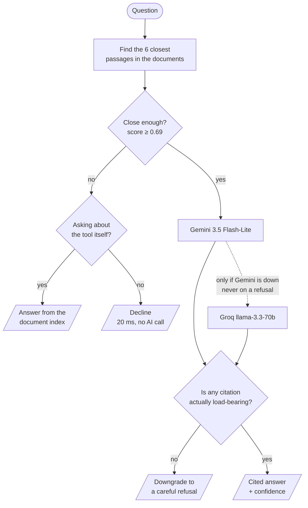

<div align="center">

# Compliance Copilot

**Ask a plain-English question about SEBI, NSE and MCX circulars on retail algorithmic trading.
Get an answer cited to a specific document and section — or a straight "not in these documents."**

[](https://compliance-copilot-eight-sigma.vercel.app)
[](https://compliance-copilot-backend.onrender.com/health)
[](https://github.com/pgvector/pgvector)
[](https://fastapi.tiangolo.com)
[](https://nextjs.org)

</div>

> [!NOTE]
> **First visit takes ~30–50 seconds.** The backend sleeps after 15 minutes idle on a free
> plan. The app shows a progress bar while it wakes up. Everything after that is fast.

> [!IMPORTANT]
> **These are my own documents.** Nine real SEBI/NSE/MCX circulars on retail algorithmic
> trading — a domain I already work in — not the pack provided. The brief allowed this if I
> said so. I chose it because you can't tell whether a compliance answer is *correct* on
> documents you don't understand.

---

## Try these

The interesting behaviour isn't the answers — it's knowing when to stop.

| Ask this | What should happen |
|---|---|
| *What is the maximum order-per-second threshold before an algo must register?* | Answers **10 orders/second**, cites the NSE circular, sections B and F |
| *How often can a client update their mapped static IP address?* | Answers **once per calendar week** |
| *What is Milestone 2 according to the MCX circular?* | Cites **MCX's own** numbering — not SEBI's differently-numbered Milestone 2 |
| *What is the capital gains tax rate on equity trades?* | **Declined in ~20ms.** Off-topic, so no AI model is called at all |
| *What are the password complexity requirements for broker API access?* | **Flags the gap.** The documents require passwords, but never say how complex |
| *What can you do?* / *What circulars do you have?* | Answers from the document index itself |

Expand **"How this answer was produced"** on any answer to see the retrieval score, which
refusal layer fired, which model served it, and how long it took.

---

## Run it locally

```bash
cp backend/.env.example backend/.env              # add GROQ_API_KEY and GEMINI_API_KEY
cp frontend/.env.local.example frontend/.env.local
docker compose up
```

Then load the documents and run the evaluation:

```bash
curl -X POST localhost:8000/ingest                     # 9 documents → 58 chunks
docker compose exec backend python -m eval.run_eval    # the eval harness
```

That starts Postgres (`5432`), the backend (`8000`) and the frontend (`3000`). Both API keys
are needed — Gemini answers first, Groq is the backup, so the backup needs its own key.

Re-tested from a genuinely fresh `git clone` before submitting.

---

## How it works



Each circular is split along its own numbering, which is why a citation can name an exact
section instead of a whole file. Every piece of text becomes a list of 384 numbers
representing its meaning; your question becomes one too, and Postgres finds the closest
matches. One database holds the documents, the text, the numbers and the query log — at this
size, a separate vector database would have been an extra moving part for no benefit.

### Knowing when to say no

This is the part that matters in compliance, and it needs **two** layers.

**Layer 1 — a similarity threshold of 0.69.** Below it, no AI model is called at all. Set from
measurements, not a guess: real off-topic questions score 0.615 and 0.651, while the *lowest*
genuinely answerable question scores 0.728. That leaves a gap, and 0.69 sits in it. My first
guess of 0.50 turned out to catch nothing at all.

**Layer 2 — the model's own refusal.** This isn't a safety net; it's load-bearing. *No
threshold can ever catch a question that's on-topic but still unanswerable.* "What are the
password complexity requirements?" scores **0.739** — higher than some questions that *do*
have answers — because the documents genuinely discuss passwords. They just never state a
complexity rule. Only something that reads the text can tell those apart.

**A third check, after the answer.** If the model claims an answer but hasn't attached a
citation that actually supports it, the system overrides it and downgrades to a careful
refusal. The model's self-reported confidence isn't trusted on its own.

---

## Results

Ten questions, four of them deliberately unanswerable. Full output in [`backend/eval/`](backend/eval/).

| Metric | Score | |
|---|---|---|
| Retrieval hit rate | **6/6** | right document found |
| Answer contains expected fact | **6/6** | |
| Citation accuracy | **5/6** | the one miss is explained below |
| Refusal accuracy | **8/10** | |

| Path | Speed | Cost |
|---|---|---|
| Declined by threshold | **~20 ms** | zero tokens |
| Answered by Gemini | **~2.0 s** | |
| Answered by Groq (backup) | **~10.9 s** | |
| Worst case, Gemini hanging | **16.4 s** | measured, not estimated |

Declining costs nothing and is ~95× faster than answering. **13% of all queries in my logs
cost zero tokens** — the refusal gate doubles as a cost control.

**Total spend: $0.** Both models ran inside free tiers and the text-to-numbers step runs
locally. Roughly 4,000 input and 200 output tokens per answer; about 1M tokens across the
whole build, which would be under a dollar at list prices.

---

## What's indexed

| Date | Issuer | What it covers |
|---|---|---|
| 30 Mar 2012 | SEBI | The original algo rulebook — what counts as an algo order, and the risk controls required |
| 04 Feb 2025 | SEBI | The framework everything else implements — API access, registration, responsibilities |
| 01 Apr 2025 | SEBI | First deadline extension |
| 05 May 2025 | NSE | Client-facing rules — static IP, the 10 orders/second threshold, two-factor auth |
| 22 Jul 2025 | NSE | How algo providers get approved and registered, with turnaround times |
| 24 Jul 2025 | NSE | Correction to the order-tagging tables |
| 30 Sep 2025 | SEBI | The glide path — milestones to Jan 2026, full compliance by Apr 2026 |
| 03 Nov 2025 | NSE | Member FAQ — static IP scope, black box hosting, permitted order types |
| 21 Nov 2025 | MCX | Reminder of milestone dates and consequences for missing them |

The app lists these with links, served from the database rather than a hardcoded list — after
a hardcoded count kept insisting "5 circulars indexed" long after the corpus grew to 9.

---

## What I built, and what I cut

**Built:** document ingestion, section-aware splitting, meaning-based search, the two-layer
refusal gate, structured output, an evaluation harness, and a web front end that shows
citations and confidence.

**Cut:** authentication, multi-turn chat, and previews of the cited text. Of the optional
extras, I did **one** properly — deployment — and skipped function calling, a review flow, and
cost logging rather than half-starting several.

**Models:** Gemini `3.5-flash-lite` answers; Groq `llama-3.3-70b` takes over if Gemini's
service fails — but *never* when the model deliberately refuses. Retrying a refusal on a
second model is shopping for a friendlier answer, which is the exact behaviour this design
exists to prevent. Text-to-numbers runs locally (`bge-small-en-v1.5`) because neither provider
sells that service.

---

## The interesting problems

<details>
<summary><b>A pattern that showed up three times: failures that look exactly like success</b></summary>

<br/>

This is the most useful thing I learned, and it happened three separate ways.

**1. Correct answers were being thrown away in transit.** The library enforcing the output
format defaults to a mode where Groq validates the reply on *its* server. Llama occasionally
returns `"false"` as text instead of `false` as a value, so Groq rejected the entire response
with an error — before any retry logic could run. The answer was right; it never arrived.
Switching validation to happen locally fixed it.

**2. An eval run that was 100% rate-limited scored a perfect 10/10.** A provider error and a
genuine refusal looked identical — same shape, same HTTP 200 — so every rate-limit error was
counted as a correct refusal. In the UI it was worse: a rate limit rendered as "not covered by
these documents", telling a compliance user their question had no answer when the service was
simply down. It also fooled *me* — an earlier reliability estimate I'd written down was
computed from samples that were all errors. Fixed by giving outages their own error type and
returning HTTP 503, so a refusal and a failure can never be confused again.

**3. Every Gemini call was silently failing over to Groq.** A missing sub-dependency made
Gemini fail on every request, so Groq answered everything — with completely correct-looking
output. The only reason I caught it is that every answer records *which provider produced it*.
Without that field, this would have shipped as "Gemini works."

> The repetition is the real finding: a failure that's indistinguishable from success is worse
> than a crash. A crash gets fixed. This kind quietly poisons a metric, a UI, and your own
> reasoning at the same time. Failure paths deserve as much verification as success paths.

</details>

<details>
<summary><b>The deploy that crashed on startup — and why pinning versions didn't fix it</b></summary>

<br/>

A routine deploy died before the server even opened a port. My first instinct — pin the
dependency versions — was reasonable, didn't work, and that was the clue: this wasn't version
drift.

Measured instead of guessed:

| | Memory |
|---|---|
| Loading PyTorch, before *any* model | **~394 MB** |
| Total with the smallest embedding model | **528–544 MB** |
| Free-tier ceiling | **512 MB** |
| After switching to ONNX Runtime | **~234 MB** |

Swapping the wrapper library saved only ~16 MB — the cost was PyTorch itself, not the layer on
top. So I replaced it with ONNX Runtime running the same model.

Before trusting it, I checked the new numbers matched the old ones across seven real passages:
identical to within ~1e-7, which is floating-point noise, and nowhere near enough to disturb a
threshold whose tightest margin is 0.004. Then re-ran the full eval and got numbers identical
to four decimal places. Verified, not assumed.

(An earlier deploy also hit this: a plain install pulled PyTorch's GPU build for a CPU-only
job, producing an 8.68 GB image.)

</details>

<details>
<summary><b>A feature I shipped broken, and what my testing missed</b></summary>

<br/>

Questions like "what can you do?" score ~0.50 and were being declined — a terrible first
impression for anyone new. So I added a layer to answer them from the document index directly,
with no AI call, so it can never invent a circular it doesn't have.

I tuned it carefully: 20 out of 20 phrasings routed correctly, 0 out of 8 real questions
hijacked. It looked verified.

Then short queries broke immediately. **"MCX circular"** scores **0.77** and
**"22 Jul 2025 circular summary"** scores **0.75** — both questions the documents answer
*well* — and both got a list of documents instead of an answer. Short phrases have weaker,
fuzzier meaning-vectors and drift toward generic ones. A test set made entirely of well-formed
questions could never have caught it.

**The fix was ordering, not tuning.** The check now runs *only* on questions the search was
already going to decline, so it can't reach a question the documents can answer. Hijacking is
now structurally impossible rather than tuned against. Raising the threshold would have
narrowed the bug without removing it — and broken "Hi" on the way.

The lesson worth keeping: **a threshold tuned on one kind of input tells you nothing about a
different kind.** "Verified" against only well-formed questions wasn't verification.

</details>

<details>
<summary><b>Simplifying my own over-engineering</b></summary>

<br/>

The provider failover started as a five-model Gemini cascade before falling back to Groq.
Worst case: **31.2 seconds** — measured properly by blocking the API's DNS inside the
container so it genuinely hung, rather than simulating it.

A closing review flagged it as disproportionate for a small internal tool, and that was right.
The failure actually observed in this build is provider-*wide* — a bad key, a missing
dependency, an outage — which one model and five models fail identically. The five-tier
version only helped in a narrower case a low-traffic tool is unlikely to hit before the backup
would have already answered.

Cut to two tiers: **16.4 seconds** worst case, roughly half, and far less to verify.

</details>

---

## Known limitations

Both measured. Neither hidden.

### 1. Adding documents made one thing worse

Growing from 5 to 9 documents dropped citation accuracy from 6/6 to **5/6**.

The question *"what's the difference between a white box and black box algo?"* used to find the
clean definition first. Now a passage from a newly added circular — which mentions those terms
while describing a *registration process* — outranks it. The model still explains it correctly,
but can't attach a confident citation, so the consistency check downgrades it to a careful
refusal.

Reproducible across reruns, diagnosed, and **kept** rather than quietly reverted. The safety
net worked exactly as designed. But it's a concrete demonstration that "add more documents"
isn't a free way to look more capable. The 0.69 threshold needed no retuning.

### 2. Self-reported confidence has a ceiling

Asked about password complexity, Gemini correctly said in prose that the documents don't
specify it — while still marking itself `confident`. Never fabricating, but structurally
overconfident.

The fix: each citation is labelled as either directly answering the question or merely related.
If nothing directly answers it, the answer is downgraded automatically.

**That catches 2 of 5 cases. The other 3 it cannot**, and the reason is exact rather than
mysterious: in those runs the model labels its citation with the *same* overconfidence that
produced the answer. The two fields agree, so there's no inconsistency to detect.

This is a **ceiling on consistency checks generally**, not a bug worth chasing: comparing two
fields the model fills in from one underlying judgment only catches cases where that judgment
contradicts itself — never where it's confidently, consistently wrong. I stopped here
deliberately, the same call I made on citation scoping across issuers.

---

## If this went to production

| | Why |
|---|---|
| **Widen the test set before trusting 0.69** | It's tuned on 2 off-topic questions. Enough to prove 0.50 was wrong; not enough to pin the value |
| **Hybrid search** | Circular numbers like `SEBI/HO/MIRSD/.../2025/132` are labels, not meaning — meaning-based search handles them badly |
| **Prompt-injection guardrails** | These documents get fed straight to a model. A poisoned source telling it to misstate a deadline is a real threat, not a hypothetical |
| **Response caching** | I hit the free-tier token wall repeatedly; identical eval questions were re-answered dozens of times |
| **Auth and RBAC** | Absent entirely |
| **Refusal-rate monitoring** | The earliest signal that retrieval quality or the corpus has shifted |

---

## How I used AI tools

Built with Claude Code, with a **reviewed checkpoint at each phase** rather than one long
autonomous run. That structure was the point — every bug worth naming above was caught at a
checkpoint, and each one would otherwise have shipped looking like success. Verification at
each phase ran against the real running system: real ingestion, real queries, real database
inspection.

Where it got in the way, honestly: I hit Groq's free daily token cap repeatedly during eval
runs and deploy debugging, which cost real time waiting rather than iterating. And on the first
deploy failure my initial fix — an oversized Docker image — was real and worth keeping, but
turned out not to be the actual cause. The honest move was saying so once the error log showed
something different, rather than quietly moving on as though the first guess had been right.
